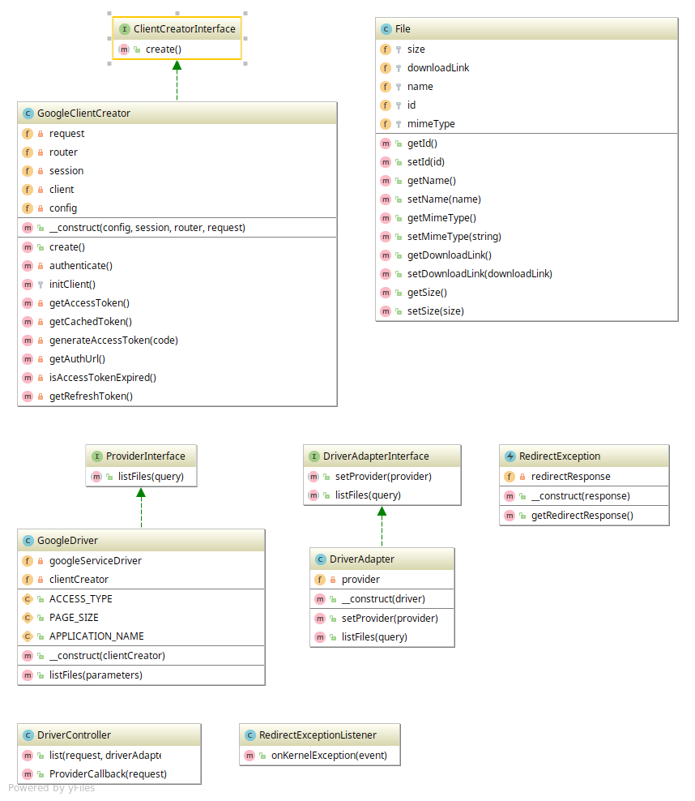

## Cashu

### Requirement

- Write a PHP Code to list your google drive files data by using Google API's.

### Class diagram



## End point
- A REST API application to get list files from google drive provider.

- GET `[base-url]/api/driver/list`
- Response 
```json
{
    "files": [
        {
            "id": "0B6mu60ho67DaLLFoRUO5ueHh6YUg2QjFrNDVtdzJzTV81U2JV",
            "name": "CROPPED-IMG_92020.JPG",
            "mimeType": "image/jpeg",
            "downloadLink": "https://drive.google.com/uc?id=0B6mud60ho67DaLsoRU5ueHhs6YUg2QjFrNDVtdzJzTV81U2JV&export=download",
            "size": "106496"
        }, {
            "id": "0B6pu60ho6aTFoRU5ueHh6YUg2QjFrNDVtdzJzTV81U2JV",
            "name": "Resume.pdf",
            "mimeType": "application/pdf",
            "downloadLink": "https://drive.google.com/uc?id=0B37Ea1sIdztZV0soiTlzNHNqN2c&export=download",
            "size": "106496"
        }
    ]
}
```

### Installing
- Copy `.env.dist` to `.env`
- Create Credentials from `https://console.developers.google.com/apis/credentials`
- Update your client_id and secret_key in `.env` file
```json
GOOGLE_CLIENT_ID=YourClientID
GOOGLE_CLIENT_SECRET=YourClientSecret
GOOGLE_REDIRECT_URI=http://127.0.0.1:8001/api/driver/callback
```
- Alson don't forget your redirect URIs while your creating the Credentials.
- Run `docker-compose build`
- Run `docker-compose run php composer install` to install the dependencies.
- Run `docker-compose up`

### Running the tests

- Run `docker-compose run php /www/vendor/bin/phpunit`

### Built With

* [PHP7.2](http://php.net)
* [Symfony4](http://www.symfony.com) 
* [jms/serializer](https://jmsyst.com/libs/serializer) - Library for (de-)serializing data of any complexity; supports XML, JSON

Please read the following docs:
- [Installing the application](docs/install.md)
